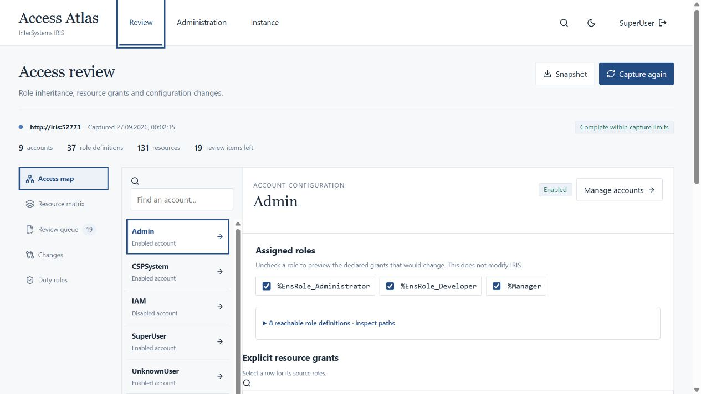

# Access Atlas for InterSystems IRIS

Access Atlas helps review access in InterSystems IRIS. Trace an account's permissions through inherited roles, preview removing a role, and save review decisions in a campaign. It also provides administration tools for applications, accounts, secrets, tasks, host resources and logs.

Built for the [InterSystems Programming Contest: Build Your Own Management Portal](https://community.intersystems.com/post/intersystems-programming-contest-build-your-own-management-portal).



Try the [interactive access example](https://igorandor.github.io/access-atlas/) without installing anything. Follow two grant paths, preview removing a role, compare supplied before/after captures and download a training review with the remaining follow-up. The data is synthetic; no IRIS connection, credentials or saved campaign are involved. [Example scope and build instructions](docs/INTERACTIVE_EXAMPLE.md).

For your own instance, follow the [first access review](docs/FIRST_REVIEW.md). You can also inspect an [exported review report](docs/examples/access-review.md) with open investigations and missing decisions.

[Watch the extended walkthrough (MP4, 2:08)](https://github.com/Igorandor/access-atlas/releases/download/v1.0.0/access-atlas-walkthrough.mp4). It follows inherited access through a saved campaign, certification and report preview. The [latest release](https://github.com/Igorandor/access-atlas/releases/latest) provides the source package; [video downloads](https://github.com/Igorandor/access-atlas/releases/tag/v1.0.0) include English captions and a transcript.

The top navigation separates **Review**, **Administration** and **Instance**. Review has its own tool rail for the access map, resource matrix, review queue and changes. Administration contains accounts, applications, security and tasks; Instance contains the overview, host resources, logs and REST explorer. Switching sections preserves the captured review until logout or reload.

[Watch the current walkthrough on YouTube](https://www.youtube.com/watch?v=MQmV8uuzKGo) (unlisted, available by link).

## The access-review workflow

1. Sign in and let **Access review** capture users, role definitions, resources and applications. Read the completeness indicator and any warnings.
2. Select an account in **Access map**. Expand a resource row to see its source-role paths. Uncheck an assigned role to preview changes locally; **Reset preview** restores the original projection.
3. In **Resource matrix**, filter by resource or account. Select a cell to inspect explicit grants, public privileges and the separate `%All` indicator.
4. Open **Review queue**. Record a reason or follow-up for broad roles, public writes or unauthenticated application entry. Export the notes as review evidence.
5. In **Changes**, choose **Use current as baseline**. Use the administration tools to make a reviewed change, return here and choose **Capture again**. Inspect before/after configuration, or import an earlier exported baseline.

This analyzes configured grants, not live authorization. Public access, special roles, escalation and missing data are distinguished explicitly. See [analysis semantics and limits](docs/ACCESS_ANALYSIS.md). Ad hoc captures stay in browser memory; campaigns save their own captures and decisions on the gateway.

For a retained review, open **Campaigns**, create a campaign and save a capture. Configure duty rules, policies and certification scope, record decisions, then inspect **Report & follow-ups**. Remediation requires a separate target review and exact confirmation; the result is read back or marked unresolved. **Next review period** copies selected settings into a new campaign without reusing evidence or decisions. See the [campaign walkthrough](docs/CAMPAIGNS.md).

**Analysis → Explain access** traces a specific account/resource or application-entry question. It separates ordinary, conditional and public grants and can export reusable question lists. **Changes** and campaign **Capture history** show field changes, inherited impact on accounts and a capture timeline. Exported HTML reports work offline and can be printed to PDF.

## Administration and evidence

| Area             | Current workflow                                                                                                |
| ---------------- | --------------------------------------------------------------------------------------------------------------- |
| Applications     | Inspect and change native web application routes, namespaces, dispatch and authentication settings.             |
| Permissions      | Manage accounts, passwords, role inheritance and resource grants.                                               |
| Security         | Wallet metadata and write-only secrets, certificate ownership, TLS and OAuth configuration/credentials.         |
| Tasks            | Create on-demand or scheduled work, edit selected fields, inspect task info and run/suspend/resume with review. |
| Host and devices | Real host observations, processes and eligible controls, device definitions and database inventory.             |
| Logs             | Messages, alerts, asynchronous audit queries, task history, journals and session receipts.                      |

Every write has a separate review step. Execution and destructive controls require a typed target. Updates compare the touched fields with a fresh native read; this reduces lost updates but is not an atomic native lock.

See [how to interpret API results](docs/API_BEHAVIOR.md) before acting on an incomplete capture, an accepted background job or an uncertain change.

For namespace-specific access, open **Access review → SQL privileges**. Inspect object and administrative grants for an account or role, retain partial results when one source fails, and export the evidence with its scope and read times. See [the SQL review guide and limits](docs/SQL_EVIDENCE.md); these separate reads do not extend the resource graph or establish runtime access.

The interface includes light/dark themes, keyboard controls, Ctrl/Cmd+K navigation and responsive layouts. In the installed portal, native API values are never replaced with sample data.

Switching tools keeps the current access review open. Refresh instance data when you need a new observation.

## Quick start: complete local installation

Requirements: Docker Engine/Desktop with Compose v2, at least 4 GB available RAM, and approximately 5 GB free disk space. Linux containers are required. On Windows, start Docker Desktop or a Docker daemon in WSL first.

Get the source with Git, then run Compose from the project directory:

```sh
git clone https://github.com/Igorandor/access-atlas.git
cd access-atlas
docker compose up -d --build
```

Alternatively, extract the source ZIP from the [latest release](https://github.com/Igorandor/access-atlas/releases/latest) and open a terminal in the directory containing `compose.yaml`. If you already have the source, run only the Compose command above.

Open **http://localhost:3200** and sign in:

- Username: `SuperUser`
- Password: `AtlasLocal-2026!`

This is a published **quick-start credential**, configured only by the bundled IRIS image. Both published ports bind to `127.0.0.1`. Use an existing instance with private credentials and HTTPS for deployment to other users.

The first image build takes several minutes. It installs the small ObjectScript/Embedded Python extension and pins the IRIS Community image by digest. The portal uses a non-root Node.js container. The `iris-data` volume preserves the IRIS manager databases across container replacement.

```sh
docker compose ps
docker compose logs --tail=80 portal iris
docker compose down          # keeps IRIS data
```

Before signing in, check `docker compose ps`: `iris` must be healthy and `portal` must be running. If startup fails, inspect the logs above before retrying; keep the data volumes.

If ports are in use, configure `ATLAS_PORT`, `ATLAS_ORIGIN` and `IRIS_WEB_PORT` together. Example in Bash:

```sh
ATLAS_PORT=3201 ATLAS_ORIGIN=http://localhost:3201 IRIS_WEB_PORT=52781 docker compose up -d --build
```

In PowerShell, set the corresponding `$env:ATLAS_PORT`, `$env:ATLAS_ORIGIN` and `$env:IRIS_WEB_PORT` variables before running Compose. Use the exact configured browser origin; `localhost` and `127.0.0.1` are different origins.

## Connect to an existing IRIS instance

Use IRIS Community **2026.2 with SysAdmin API v2**, or a compatible newer instance. The bundled stack pins 2026.2 build 221U. IRIS for Health exposes the same management APIs, but the included automated live checks were run on standard IRIS Community; a separate IRIS for Health installation has not been certified here.

1. Enable `/api/admin` with password authentication on your IRIS instance. Keep normal IRIS security resource checks in place.
2. Install the extension in `%SYS`. Copy `iris/Atlas` to your server, then run:

   ```objectscript
   zn "%SYS"
   do $SYSTEM.OBJ.LoadDir("/path/to/iris/Atlas","ck",,1)
   do $SYSTEM.Status.DisplayError(##class(Atlas.Installer).Install())
   ```

   The installer creates `/api/atlas` with password authentication and `%Admin_Operate` protection. It does **not** change existing account passwords. `iris/configure.script` is only for the bundled quick-start image; never run it on an existing environment.

3. Install Node.js 22.12 or newer and configure the portal:

   ```sh
   npm ci
   cp .env.example .env
   # Set IRIS_URL to your existing instance and PUBLIC_ORIGIN to your browser URL.
   npm run dev
   ```

4. Open **http://localhost:5174** and use your IRIS credentials. You need the relevant `%Admin_*:USE` privileges for each operation. Errors from insufficient privileges are displayed, not bypassed.

For a production build:

```sh
npm run build
# Set PUBLIC_ORIGIN=http://localhost:3200 for this local production server.
npm start
```

For a gateway container connected to an existing IRIS instance, set `IRIS_URL`, a stable `IRIS_INSTANCE_ID`, and an exact HTTPS `PUBLIC_ORIGIN`, then run `docker compose -f compose.gateway.yaml up -d --build`. Use a root origin for `IRIS_URL`, such as `https://iris.example:52773`, without `/api/admin` or another path prefix; Atlas addresses the fixed `/api/admin` and `/api/atlas` routes itself. Startup rejects path prefixes and HTTP public origins combined with secure cookies. It starts only Atlas, requires secure cookies and binds to loopback for a TLS reverse proxy. The `campaigns` volume stores review campaigns. See [deployment and security](docs/DEPLOYMENT.md).

## Administration walkthrough

1. Under Administration, choose Application register and inspect an existing route. Select Propose changes, include Description, edit its inspected value and review the before/after proposal.
2. Under Account register, inspect roles and their nested grants. A new or changed object includes only selected fields; native errors preserve the proposal for correction.
3. Security register includes wallet boundaries and secret metadata. Select a collection before creating or rotating an entry. Stored secret values cannot be retrieved.
4. Task register shows native task execution state separately from configuration. Create an on-demand Atlas.DemoTask in %SYS to record a harmless timestamp in ^AtlasDemo; inspect task history to verify execution.
5. Under Instance, choose Instance status and load Host capacity and counters. The data describes the OS visible to IRIS. CPU ticks are cumulative, not a sampled utilization percentage.
6. Host & devices provides process inspection and reviewed controls, device definitions and database inventory.
7. Logs normalizes loaded messages, alerts, audit records and task history, with severity/time/text filters, window comparison and CSV export. Filtering applies to the loaded window. Session history lasts only for the current gateway session.
8. REST workbench exposes fixed native reads with contract-derived inputs, reusable query plans, captured results and comparison. It accepts no arbitrary URLs or writes.

## Development and verification

```sh
npm ci
npm run check                 # Builds, security, contract and graph-analysis tests
npm audit                    # dependency audit
```

Live tests create **temporary administrative records** and clean them up. Only run against a disposable instance:

```sh
export IRIS_TEST_USER=SuperUser
export IRIS_TEST_PASSWORD='AtlasLocal-2026!'
npm run test:live
npm run test:workflows
npm run test:access            # Real nested roles, source paths and snapshot comparison
```

For PowerShell, use `$env:IRIS_TEST_USER='SuperUser'` and `$env:IRIS_TEST_PASSWORD='AtlasLocal-2026!'`.

The live suites verify create/update/read/delete behavior, account disablement, wallet metadata isolation, task scheduling and execution controls, OAuth configuration and asynchronous audit retrieval. Read [the verification record](docs/VERIFICATION.md) for exact coverage and known platform differences.

## Architecture

```text
Browser (React + TypeScript)
        │ same-origin JSON + HttpOnly session cookie + CSRF token
Node.js gateway (Express)
        │ fixed IRIS upstream; user's credentials held in memory
        ├── /api/admin → native SysAdmin v2 APIs
        └── /api/atlas → protected ObjectScript + Embedded Python extension
```

- `src/features/access`: access map, resource matrix and review queue.
- `shared/access-model.ts`: pure graph traversal, finding rules and comparison.
- `server/access-snapshot.ts`: bounded native configuration collector.
- `shared/snapshot-schema.ts`: strict baseline import validation.
- `src/pages/AccessReview.tsx`: review orchestration; `src/desk`: configuration register, proposals and evidence reads.
- `src/components`: product-specific evidence views and dialogs.
- `shared/register.ts`: configuration register; `shared/schema.ts`: contract access.
- `shared/iris-openapi.json`: unchanged upstream specification; `iris-contract.json`: generated request-only projection.
- `server`: sessions, origin/CSRF protection, allowlisted upstream requests and response handling.
- `iris/Atlas`: native extension, installer and harmless demo task.
- `tests`: security boundaries and contract checks; `scripts`: reproducible live checks.

See [architecture](docs/ARCHITECTURE.md) and [contest coverage](docs/CONTEST.md).

## License and attribution

Original application code is MIT licensed. The InterSystems API specification is attributed separately in [THIRD_PARTY.md](THIRD_PARTY.md). InterSystems IRIS is a separately licensed product and is not covered by this repository's MIT license.

See [data views and limits](docs/DATA_VIEWS.md).

## Local duty rules

Open Review → Duty rules after capturing configuration. Enter a rule title and two different roles that should be reviewed together; add the rule. Evaluate ordinary conflicts, conditional escalation paths and unknown evidence separately. Inspect a row for its role paths. Export rules for reuse or Export evaluation for the rules, capture time, instance, warnings and results. Imports accept an exported JSON array up to 32 KB and 20 rules. Disabled accounts are excluded unless their configuration is unreadable. Rules remain in this view while changing tabs and clear at logout/reload. These rules do not enforce permissions or prove denied runtime access.

See [the original project idea](IDEA.md). The written walkthrough above is part of the contest demonstration. Watch the [video walkthrough](https://www.youtube.com/watch?v=MQmV8uuzKGo), recorded from actual application interactions with English captions and CC0 music. Recording details and credits are in [VIDEO.md](docs/VIDEO.md).

## Author

[Igor Podlewski on Developer Community](https://community.intersystems.com/user/igor-podlewski) · [GitHub](https://github.com/Igorandor)
