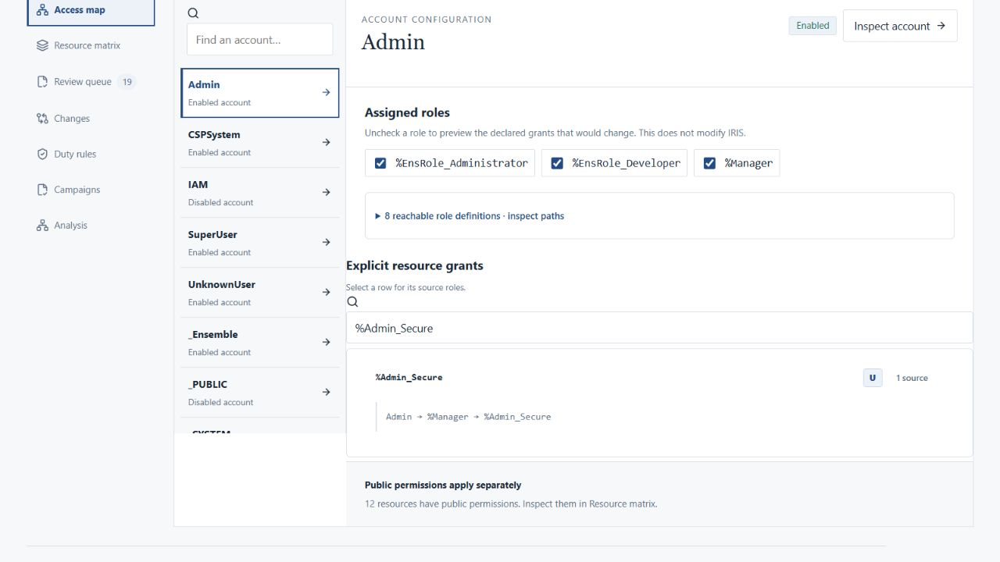
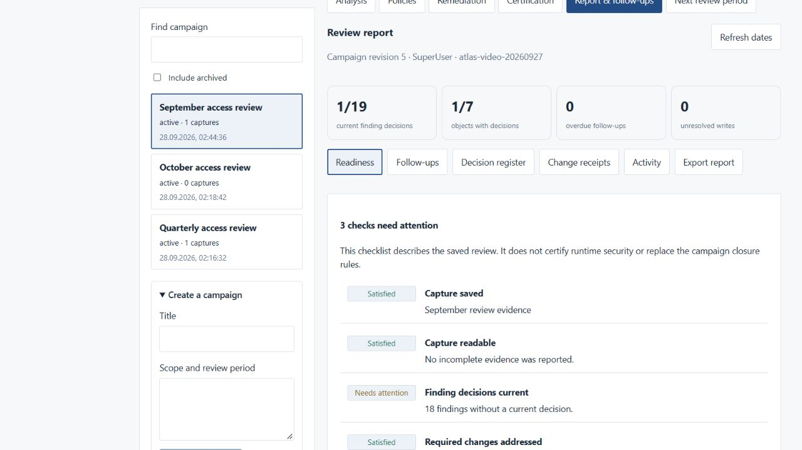

# Try an access review

This short walkthrough uses the accounts and roles in the bundled IRIS Community installation. It reads configuration and saves review records; it does not change native permissions.

For a no-install introduction, try the [interactive grant example](https://igorandor.github.io/access-atlas/) with synthetic accounts. The steps below use your running IRIS instance and retain a review record.

Follow the [README quick start](../README.md#quick-start-complete-local-installation) to obtain the source and start the stack. Open <http://localhost:3200>, sign in with its quick-start credentials, then wait for the capture to finish and check its completeness label.

## 1. Explain one grant

In **Access map**, select **Admin**, then filter resources to `%Admin_Secure`. Expand the resource to see its source path through `%Manager`. This explains the captured configuration; it is not a test of what an existing session can do.

Uncheck `%Manager` under assigned roles. The preview shows the declared grants that depend on that role. Nothing is sent to IRIS. Choose **Reset preview** before continuing.

If a role definition is missing or could not be read, its grants are unknown. The map and matrix retain the paths they can explain, but mark the account evidence as incomplete. Removing an unreadable role in the preview cannot establish the full effect of that removal; the change count covers only known grants. Read the missing definitions with an appropriately authorized account before drawing an access conclusion. A captured role cycle alone does not imply missing data.

An existing instance may have different accounts or assignments. Select a known account and inspect its own source paths instead of expecting the bundled values.

## 2. Keep a review record

Open **Campaigns**, expand **Create a campaign**, and give the review a title and scope. Create it, label the observation, and choose **Capture access**. Campaign evidence is retained on the gateway for this account and configured instance.

Under **Decisions**, review one finding. Choose **Investigating**, write the question that needs answering, and set a follow-up date. **Save decision** records the review; it does not revoke access. The saved outcome, timestamp and follow-up date appear beside the form.

If you cancel the decision, open a different finding, or return to follow-ups with unsaved changes, choose **Keep editing** or **Discard draft**. Discarding does not save. Save your work before leaving the campaign or switching workspaces.

Do not accept all findings just to obtain a green report. For example, a `%All` account requires an operational justification, while an unauthenticated route may have its own authorization controls.

## 3. Review accounts without automatic findings

Under **Certification**, expand **Certification scope**, require certification, leave **accounts** selected, and save the scope. Select an account to inspect its direct roles, inherited access and captured configuration.

Record **Investigate** when evidence or ownership is unclear. A certification decision is separate from a finding decision, and both are separate from changing IRIS.

Switching to another object asks before discarding an edited decision. When you arrive from a follow-up, **Back to follow-ups** also checks for unsaved decision or scope changes.

To understand an earlier decision, open **Activity** and expand its saved decision evidence. Read the reason, follow-up date and capture identifier attached to that revision. **Report & follow-ups → Activity** offers the same evidence. An older decision describes the review at that time; use **Certification** or **Decisions** to check the current review status. Include **Campaign activity** when exporting a report if the recipient needs that history.

## 4. Export the work that remains

Open **Report & follow-ups**. **Readiness** lists missing decisions and unresolved investigations. **Follow-ups** puts outstanding work and dates in one queue. **Open finding** or **Open certification** opens the corresponding review; **Back to follow-ups** keeps the report filters. Save your changes or explicitly discard the draft before returning. Under **Export report**, choose **Preview report** to check the selected sections and optional reviewer note. Close the preview, then download Markdown for a repository or printable HTML for offline review and PDF printing.

On a narrow screen, scroll wide HTML report tables horizontally to read all columns. A keyboard user can focus the named table region and use the arrow keys.

For a focused work list, filter **Follow-ups** by source, text or **Overdue only**, then choose **Export filtered agenda CSV**. The export includes all matching rows, including later pages, and recalculates overdue dates for the current UTC day. The on-screen counts refresh at the same time. A follow-up date schedules review work; it does not expire a decision or revoke access.

Inspect the [example report from the recorded walkthrough](examples/access-review.md), or download [its standalone HTML version](examples/access-review.html). It intentionally shows unfinished work. The example is a saved report, not a live demo or a security certification.

These screenshots use the bundled instance and a presentation campaign. Your account counts and review progress will differ.

## 5. Start the next period

**Next review period** previews which settings will be copied. Review the title, scope and new due date, then confirm. The new campaign starts without prior captures or decisions; the original remains available. Capture current access before making the next period's decisions.
